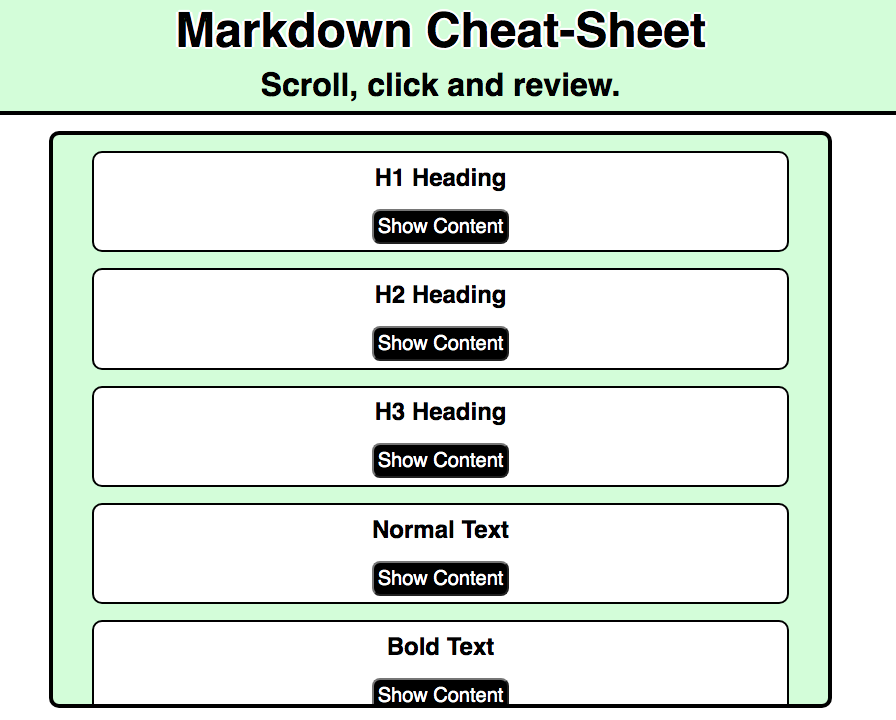
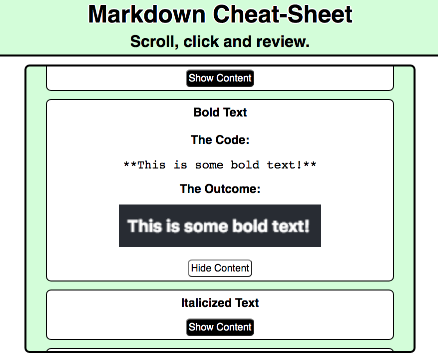
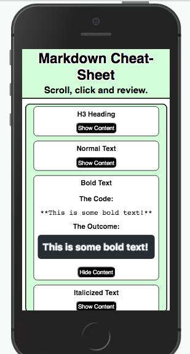

# Markdown Cheat-Sheet

This is a basic Markdown cheat-sheet.

---
## Build with:
* JavaScript
* CSS
* HTML
---
## App Image: Starting Image.

---
## App Image: In-use Image.

---
## App Image: Responsive Example.

